## How the operator scales up a datacenter

Given `CassandraDatacenter` like the following:

```yaml
apiVersion: cassandra.datastax.com/v1beta1
kind: CassandraDatacenter
metadata:
  name: dc1
spec:
  clusterName: cluster1
  serverType: cassandra
  serverVersion: "3.11.7"
  managementApiAuth:
    insecure: {}
  size: 1
  storageConfig:
    cassandraDataVolumeClaimSpec:
      storageClassName: server-storage
      accessModes:
        - ReadWriteOnce
      resources:
        requests:
          storage: 1Gi
  racks:
    - name: r1
```

When a user scales up the datacenter, for example, by doing the following:

```
kubectl patch cassandradatacenter/dc1 --patch '{"spec":{"size":3}}' --type merge
```

This is what the Cass Operator will do:


